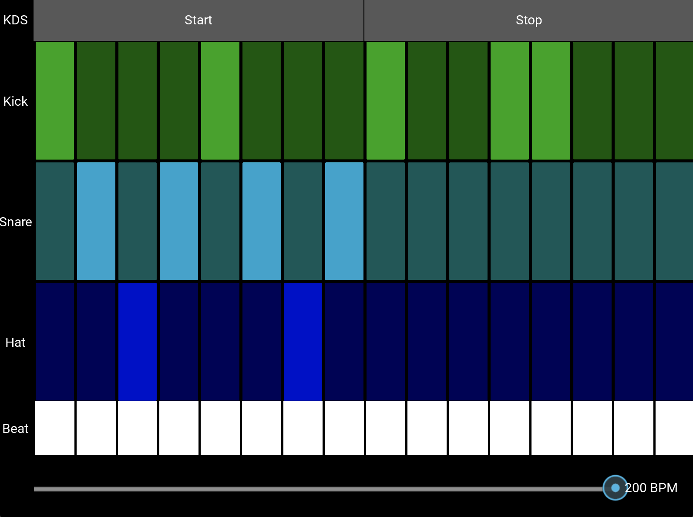

# Drum Sequencer App
A simple drum sequencer app built with Kivy. Create beats with kick, snare, and hi-hat sounds, and play them back at a desired BPM.

## Features
- Three instrument tracks: Kick (K), Snare (S), and Hi-hat (H).
- Sixteen steps per instrument track.
- Adjustable BPM slider, ranging from 40 to 200 BPM.
- Start and Stop controls for playback.
- Visual beat indicators that light up on the current beat.

## Installation and Running
1. Ensure you have Kivy installed:`pip install kivy`
2. Clone the repository or download the source code.
3. Navigate to the directory containing the app's code.
4. Run the app: `python main.py`

## Usage
1. Click on the instrument buttons (toggle buttons) to activate or deactivate beats.
2. Use the slider to adjust the BPM (beats per minute).
3. Press "Start" to play your sequence.
4. Press "Stop" to halt playback.

## Sounds
The app utilizes .wav sound files for the kick, snare, and hi-hat. Ensure these sound files are located in an instruments directory:

- instruments/hat.wav
- instruments/snare.wav
- instruments/kick.wav

## Future Enhancements
- Add more instruments and sound samples.
- Save and load beat patterns.
- Implement advanced playback controls such as pause and rewind.

Contributing
Pull requests are welcome. For major changes, please open an issue first to discuss what you'd like to change.
